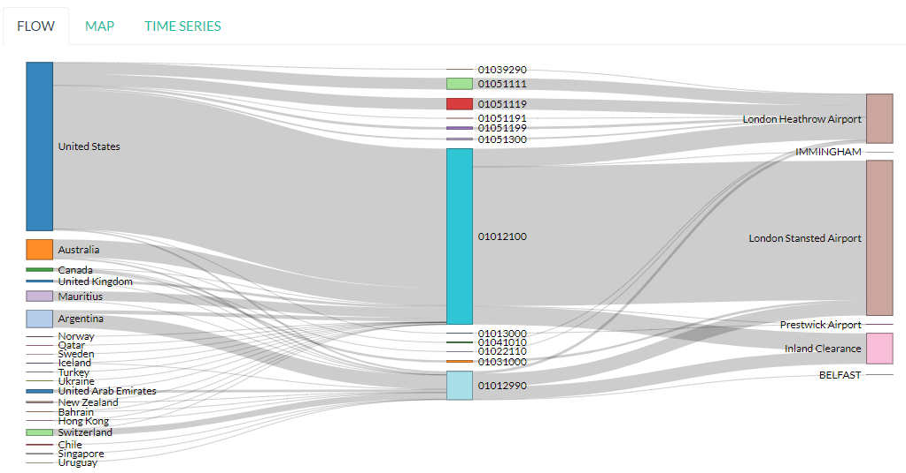
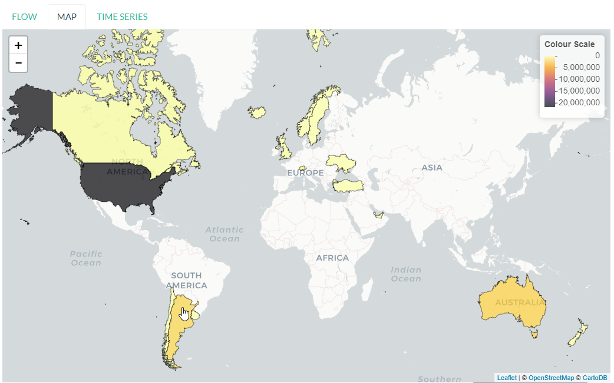
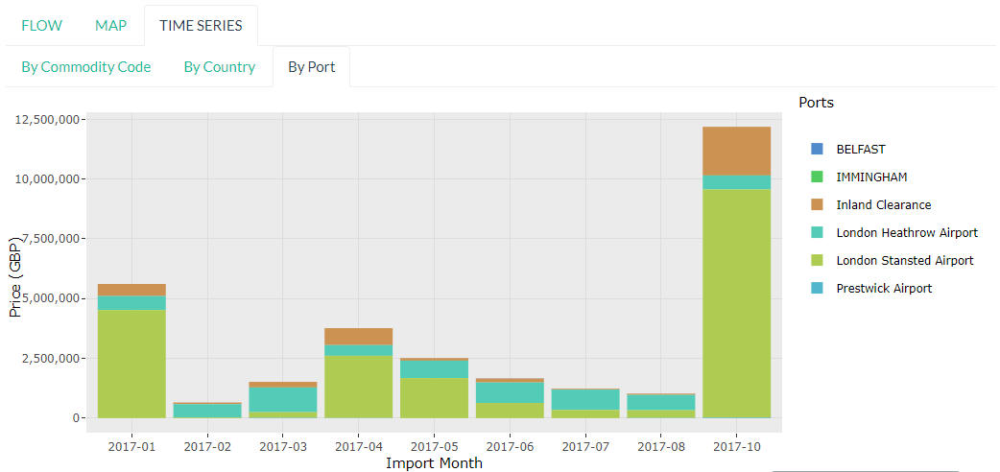

# Table of Contents

1.  Introduction
2.  Live R Scripts
    1.  Data Cleaning and Setup
        1.  `DownloadData.R`
    2.  Loading Data to the Database
        1.  `InitialiseDataTables.R`
        2.  `InitialiseMetadataTables.R`
        3.  `MonthlyUpdate.R`
    3.  Other Scripts
        1.  `checkLoad.R`
        2.  `checkFoodBalance.R`
3.  Shiny Application Script `app.R`
    1.  Packages
    2.  Functions
        1.  `descendants(data,code)`
    3.  Database Connection
    4.  Preamble
    5.  `ui()`
        1.  Welcome Page
        2.  Commodity Code Lookup
        3.  Non-EU Trade
        4.  EU Trade
    6.  `server()`
        1.  Server Side Commodity Code Lookup
        2.  App Behaviour Settings
        3.  Execute Query
        4.  Filter Date/Unit in Data
        5.  Clean and Shape Data
        6.  Fill in the Plots
        7.  Data Download
        8.  EU Data
4.  Complexities
    1.  Commodity Codes
    2.  Shiny Application
        1.  Price per KG

# Introduction

Welcome to my Trade Data Visualisation project. This project is an online tool developed in R, with a frontend in Shiny. It talks to a PostgreSQL database hosted on AWS. Its purpose is to simplify the act of working with UK Trade Data; which is archived at [UKTradeInfo](https://uktradeinfo.com) in nested Zip files.

The data itself isn't very descriptive. You have to cross reference a bunch of different explanatory documents to understand the format of the data, what each column represents, Country/Port/Commodity codes, etc. This application does all of this for the user by doing all the necessary data work on a PostgreSQL database, which is maintained fully by (and can be recreated completely from) the Live R Scripts in this repository.

A similar tool existed in the past, but was not robust and not entirely suited to the FSA's needs; it broke in 2016 and was never repaired henceforth. This application was designed from the ground up to the FSA's specific stakeholder requirements and is far more robust. This readme is to serve as the administration guide for the application, so it can be maintained by anyone, not just myself.

# Live R Scripts

## Data Cleaning and Setup

### `DownloadData.R`

This R Script automatically connects to [UKTradeInfo](https://uktradeinfo.com/), and downloads the archives for a set number of years of the following files:

-   SMKA12 // Commodity Codes and their Descriptions
-   SMKI19 // Imports from Non-EU Sources
-   SMKE19 // Exports to Non-EU Destinations
-   SMKM46 // Imports from EU Sources
-   SMKX46 // Exports to EU Destinations

More information on these files, as well as their column names and formats, can be found in the [File Glossary and Specifications](https://github.com/fsa-analytics/TradeDataVis/tree/master/File%2520Glossary%2520and%2520Specifications) section of the repository.

## Loading Data to the Database

*Note: A PostgreSQL Database must be set up either locally or remotely for these scripts to work. Their parameters must be saved in the `.env` file in the order denoted by the `.env.example` files in the repository.*

### `InitialiseDataTables.R`

This script takes the unzipped `SMK*` files and loads them into a PostgreSQL database defined in the user-specified `.env` file, to be found in the root directory of the repository. Four tables are created (or destroyed and recreated if they already exist):

-   `imports`
-   `exports`
-   `arrivals`
-   `dispatches`
-   `control`

There's a lot more processing that goes on for the control table; this is because SMKA12 files (control) are far more dirty and require lots of string manipulation (to homogenise quotes, pad commodity codes to appropriate lengths, deal with heterogeneous column specs over time, etc.) It also requires `UPSERT` functionality. More detail on this can be found in the **Complexities/Commodity Codes** section below.

Lastly, it defines indices for the `imports`, `exports`, `arrivals` and `dispatches` tables. This means that, when queried by the application, query times go from \(>1\) minute to \(~2-10\) seconds.

### `InitialiseMetadataTables.R`

This script creates the following tables:

-   `comcode`
-   `country`
-   `port`

These tables are used for lookup tables, replacing codes with descriptions in visualisations and selectors, etc.

1.  `comcode` table

    Since HMRC's `SMKA12` control file (which contains 8-digit commodity codes [with a trailing 0 for some unknown reason]) doesn't contain 6/4/2 digit commodity codes, there's no way to know the structure of the commodity codes. You can't build a hierarchy from just 8-digit codes without any parent information! Thankfully, we can obtain a structure from [Eurostat](http://ec.europa.eu/eurostat/). They update a full list of commodity codes every year. While they won't have legacy codes that we need for past data, it allows us to build a structure by following this rule:
    
    > All codes of the form `wwxxyyzz` will be children of either `ww`, `wwxx`, or `wwxxyy`.
    
    Simple, right? So everything under `0101xxyy` must be descendants of `0101`. So this code basically:
    
    1.  Copies the `control` table.
    2.  Adds a *parent* column by stripping the last two characters off a commodity code, and checking whether it exists. If not, it strips off another two characters, and so on until a parent is found.
    3.  Joins descriptions onto the end of the table.
    
    This results in a simple table with *comcode*, *parent*, and *description* fields, which can be completely imported into the application for multiple purposes.

2.  `port` table

    Again, a data file for this section (latitude and longitude information for different port codes) needs to be downloaded automatically from [UN/LOCODE](http://www.unece.org/cefact/codesfortrade/codes_index.html) and renamed to LatLonPorts.zip. For both this and the Eurostat `comcode` data file, the URL changes very regularly. So you can either download manually when you run the script, or you can uncomment the automatic download utilities in the script and replace the URL with the updated one. The choice is yours.
    
    The list of Ports (Air and Sea) is downloaded automatically from [UKTradeInfo](https://uktradeinfo.com/) and cleaned, to get fields *portcode*, *portname*, and *type* (either Airport or Seaport). Then the UN/Locode lat/lon file is unzipped, merged with `missingports.csv` (found in the root of the repository, manually compiled since UN/LOCODE was missing some ports), and joined onto the dataframe built from UKTradeInfo data. This gives a final table with *portcode*, *portname*, *type*, *lat*, *long*. At the time of writing, *lat* and *long* are not used, since UN/LOCODE only has lat/lon coordinates going down to 2 or 3 d.p! This is quite inaccurate when mapped at the UK level (but fine for the worldwide level), so many ports look very wrong. Work in Progress&#x2026;!
    
    Note that there is some logic to strip out minor ports. When the port file is imported into R, you may notice that portcodes are not unique! This is obviously unacceptable. Although, upon close inspection, you will notice that there is always one capitalised port for duplicated portcodes. This is the "main port" for that code. We strip away the minor, non-capitalised ports, since they are inconsequential and can lead to misleading results in the visualisations. Doing this provides us a primary key on portcodes, which can be used for matching.

3.  `country` table

    This one's easy. UKTradeInfo has a list of country codes available with a very static URL. It's downloaded, cleaned, and entered into the `country` table. Then we have a lookup table for countries, the same as we have for ports and comcodes, that can be imported into the application *as-is* so it can be used for lookups.

### `MonthlyUpdate.R`

This is a modified `InitialiseDataTables.R`, with some additional bells and whistles. By modifying the `syr` and `smth` variables, you can load a single month of data into the database. Before loading anything, it checks if there's more than 50 records with that month, to stop double-loading into the database.

## Other Scripts

### `checkLoad.R`

A simple script which queries the `imports`, `exports`, `arrivals` and `dispatches` databases and aggregates the number of records per month, then plots these on a line graph together. Useful to run to make sure that the Monthly Update worked.

### `checkFoodBalance.R`

Similar to `checkLoad.R`, but this actually collects trade values/volumes per month for food products (Commodities 01-23, very rough metric for "food"!).

# Shiny Application Script `app.R`

You can find this in the *Shiny* folder in the root of the repository. This contains its own `.env` file, which is published with `app.R` to [shinyapps.io](https://shinyapps.io/) from the RStudio Publish function.

> **WARNING**
> 
> **You will struggle to understand how the application works if you do not have a basic working knowledge of Shiny applications. Concepts like reactivity are difficult to get your head around at first. The `app.R` script is very long, and not executed in a linear fashion by the Shiny server. Make sure that you have a working knowledge of Shiny and reactivity first. I recommend starting [with this video tutorial](https://shiny.rstudio.com/tutorial/), making a couple of basic apps using online templates, *then* taking a look at `app.R`.**

## Packages

Below is a list of all the packages used by the application.

-   `shiny`
-   `shinyjs`
-   `shinyWidgets`
-   `shinycssloaders`
-   `shinythemes`
-   `tidyverse`
-   `devtools`
-   Development Versions of:
    -   `ggplot2`
    -   `pool`
-   `RPostgreSQL`
-   `networkD3`
-   `rgeos`
-   `maptools`
-   `maps`
-   `DT`
-   `leaflet`
-   `plotly`
-   `scales`

## Functions

Below is a list of custom functions used in the application, and how they work.

### `descendants(data,code)`

-   Arguments:
    -   `data`: Data Frame with columns *commoditycode* and *parent*. Used to look up descendants.
    -   `code`: Character vector containing commodity codes to find the descendants of.

This function implements a recursive algorithm to obtain all the descendants of a vector of commodity codes. It finds all the children of the codes in the *code* vector. If these are all 8-digit codes, great! The function exits. If they aren't, then there must be more children, since 2/4/6-digit codes must have children.

## Database Connection

The shiny app needs to connect to the database in a way such that it supports multiple users. In order to do this, I'm using a package called `pool`. It opens up a certain amount of database connections (in our case, 3) and opens more if more connections are required by people using the application. Using an elastic database connection system like this means that parallel queries are possible for when many people are using the app at once. It has a maximum database connection limit of 40; this is effectively a hard limit on the number of concurrent users who can use the app at once. This can be raised to 100 without making changes to the underlying Postgres database.

## Preamble

There is some code in `app.R` prior to the "meat" of the Shiny App, the UI and Server functions. This is mainly used for setup functions and loading in lookup tables from Postgres. In order, here are the tasks performed:

-   Load `port`, `country`, `comcode` tables into R and clean them up by removing duplicates.
-   Generate secondary lookup dataframes:
    -   `comcodelookup`: same as comcode, but with the *commoditycode* field as a factor. Used to allow multiple comcode searches in the comcode lookup tab.
    -   `desclookup`: a combination of `portcode` and `countrycode` dataframes for replacing port/countrycodes with descriptions in selectors and visualisations.
    -   `comcode_x`: Replace x with 2/4/6/8. Subsets of the `comcode` dataframe by commodity code length. Used for the 2/4/6/8-digit commodity code selectors in the UI.
-   Creating the `dates` list; in a universal format (YYYY-MM), in reverse order, including the 2.5 month time lag on trade data becoming available.

## `ui()`

There are five sections to the `ui` function. It uses a `navbarPage` setup; which is essentially multiple fluidpages found under different tabs. So; five tabs are accessible and each is defined with a big `# <NAME> PAGE` title to separate them easily.

### Welcome Page

This is a bit of a dump of shiny-fied HTML with no interactive elements. In shiny, HTML tags are implemented as methods of the `tags` object. So HTML: `<b>text</b>` is implemented with the syntax in R: `tags$b("text")`. This acts as the user guide for the application, so make sure it is regularly updated and descriptive.

### Commodity Code Lookup

A very simple tab that fulfills a very important function. It simply contains a DataTable (from package `DT`) for looking up commodity codes using search bars. Its properties are defined in the `server` function.

### Non-EU Trade

This will be very similar in layout to EU Trade. In the `head` section of the HTML, a custom theme for the progress bar is defined. The rest of the code in this section is mostly organised into fluidrows so I can organise the UI Elements like `selectizeInput` boxes into neat columns.

1.  Query Pane

    From left to right, this pane contains:
    
    -   Date Start and End selectors, with options defined in the preamble (`dates` vector)
    -   Country and Port selectors, containing the *countryname* and *portname* fields of the countrycode/portcode lookup dataframes loaded in the preamble.
    -   Comcode Selectors (2/4/6/8 digits). These use the `descendants` function defined in the preamble to repopulate all the descendant selectors with its children. So, selecting 01 in the 2-digit selector will populate the 4/6/8-digit selectors with its descendants.
    -   Radio Buttons to choose between Imports/Exports and the button to execute the query.

2.  Comcode Legend

    This is a simple DataTable populated with all the 8-digit commodity codes found within the current query, along with their descriptions. It acts as a quick-reference table so you don't have to switch tabs to the Comcode Lookup page and search for the relevant codes.

3.  Filter Pane

    This fluidrow contains controls for filtering the results of the query made in the **Query Pane**. It contains:
    
    -   All tickbox: This tickbox controls whether the visualisations show all the data in the query, or single months.
    -   Date Slider: This becomes active if the All tickbox is unticked (disabled by default). It is a slider which allows the user of the application to select individual months in the query's date range. Sliding across the Date Slider allows you to see the evolution in time of the trade data.
    -   Unit Selector: A radio button selector which allows you to change the Units represented in the visualisations. For Non-EU Trade, you can select between *Price* (£), *Weight* (KG), and *Price per Kilo* (£/KG).

4.  Visualisation Pane

    The real star of the show. A tabsetPanel allowing you to switch between:
    
    -   Sankey Diagram: for viewing the flow from country > commodity > port. Implemented with the `networkD3` package.
    -   World Map: for viewing the distribution of imports/exports on an interactive world map. Implemented with the `Leaflet` package.
    -   Time Series: Stacked bar charts by Country, Commodity and Port. Allows you to view the proportion of trade between different countries/commodities/ports. Implemented with the `Plotly` and `ggplot2` packages.
    
    All of these visualisations are interactive, allowing the user to obtain more information by hovering, clicking, etc. They are mostly wrappers for Javascript libraries, implemented in R for Shiny Applications.

5.  Download Button

    Simple as that. Allows the user to download the full set of data queried in the **Query Pane**.

### EU Trade

Exactly the same is Non-EU Trade, except with the removal of Port selection, the removal of *weight* and *price per kilo* unit selections (as the weight field for EU trade data is highly unreliable) and the addition of *number of consignments*, which is included in EU Data but not Non-EU Data.

## `server()`

The server function is the engine behind the application - what drives all the visualisations, selectors, etc. This section will go through and explain the different sections of the code, as defined by the capitalised headers for each section.

The application first defines all reactive values necessary for the application. When the queries are run, these reactive values are populated with raw and processed data (in formats relevant for each visualisation; Sankey/Map/TimeSeries).

### Server Side Commodity Code Lookup

This section contains the code necessary for rendering the DataTable (which is essentially a bunch of arguments for the different options offered by the `DT` package for the `renderDataTable()` function).

### App Behaviour Settings

1.  ShinyJS OnClick Statements

    We use the `shinyjs` package for some fine tuned javascript settings. This section contains code to:
    
    -   Blank out the commodity code selectors when clicked (Non-EU and EU)
    -   Disable/Enable the Date Slider according to whether the All tickbox is Enabled/Disabled (respectively)

2.  Conditional Labelling/Entries on Query Parameters

    The first `observeEvent` removes past dates from the *dateend* selector. The second `observeEvent` changes the label of the Country selector to Origin/Dispatch (for Non-EU/EU respectively).

3.  Clear Dropdowns

    This is just an `observeEvent` to reset all the selectors back to their defaults.

4.  Observe Statements for Modifying Dropdowns

    When the commodity code selectors are changed, then all of the descendant levels need to be updated to show only descendants of those commodity codes. By default, the selectors show all valid commodity codes to begin with. Then, when the 2-digit selector is changed to, say, `01`, then the 4-digit, 6-digit and 8-digit selectors need to be updated to show *only the descendants of commodity code `01`*.
    
    So, using `observe()` functions, which fire the code contained within them whenever a reactive object in that code block is changed, we are able to make the selectors update with descendants whenever they're changed, and only when they're changed. 
    
    There is also an `All` option in the selectors; this is used when you don't want to specify the detail all the way down to 8-digit level. You may be interested in *All Live Horse Imports*. You would then select `01` in the 2-digit selector, `0101` in the 4-digit selector, and leave the 6 and 8-digit selectors on "All". This allows the user to make wider ranging queries easily, rather than having to hunt down all horse-related 8-digit commodity codes.

### Execute Query

This code runs when the *Run Query* button is pressed. The code in this section is wrapped in an `observeEvent()` function, which runs the code if and only if the reactive object specified in the first argument (so `input$queryButton`, for us) is activated or changed in some way. Since it's a button in our case, it reacts every time it is pressed and executes the code.

The point of this block of code is to essentially take the input information from the Query Pane, construct a valid SQL query from this, and query the PostgreSQL table that holds all the trade data to get the data in an R Dataframe for analysis and visualisation.

The following list is the tasks executed and how they work.

-   Pop a progress bar onto the screen.
-   Ensure the `nullDataframe` reactive object is set to FALSE for error handling.
-   Construct the commodity codes to be queried
    -   If the selector was set to "All" or left blank, sub in two underscores `__`. This is a wildcard character in PostgreSQL's regular expression engine, which we use to filter on commodity codes.
    -   Once the four vectors of commodity codes are constructed, paste them together to get a vector of (maximum) 20-character strings. Take the final 8 characters from these strings to obtain the commodity codes to query.
        -   This is a very weird way of doing things; ordinarily one would use if/elseif/else logic to determine what the lowest level of detail selected in the query pane was, and append trailing underscores to get all 8-digit commodity codes that descend from it. But, this is less computationally intensive, and elegant in it's own stupid way&#x2026;!
-   Create a list of Ports and Countries to be queried, either by taking the full list defined in the `portcode` and `countrycode` dataframes, or filter by those chosen in the Port and Country selectors.
-   Modify the DateSlider with values between the Date Start and Date End selectors
-   Convert the `daterangequery` vector to the format used in the `import` and `export` tables.
-   Construct the query and store it in the `dataquery` character string. It is heavily parametrized due to the number of options that need to be added in.
    -   Define the parts of the query that are dependent on whether the user wants Imports or Exports. This affects:
        -   The ordering of fields in the `SELECT` statement.
        -   The field selected in the `country` section of the `WHERE` statement. For Imports, you want *Country of Origin*. For Exports, you want *Country of Dispatch*.
        -   The ordering of fields in the `GROUP BY` statement.
    -   Paste together the various components of the query to get a single string.
        -   Note that this string will be *extremely* long. The string constructed will have a very large number of commodity codes, ports and countries in it. This is because the `comcodequery`, `countryquery`, `portquery` and `daterangequery` vectors will likely contain a large number of elements, which are collapsed into a format recognisable to PostgreSQL's Regular Expression (`regex`) engine. This is of the form `(<item1>|<item2>|...|<itemN>)`, where the pipe `|` is a logical `OR` operator.
-   Execute the query and store the result in the `dataraw` dataframe.
-   Check if the query returned data:
    -   If not, set the `nullDataframe` flag to `TRUE`, and display a modalDialog with an error message. Then break out of the reactive chain with `req(FALSE)`.
-   Simplify the column names of `dataraw`.
-   Split `dataraw` into two dataframes:
    -   `portsumraw`: Eliminate the *port* field, group by *country* and *comcode*, and aggregate numeric values.
    -   `countrysumraw`: Eliminate the *country* field, group by *comcode* and *port*, and aggregate numeric values.
-   Translate the months in `portsumraw` and `countrysumraw` back into the `YYYY-MM` format used elsewhere in the application.
-   Handle missing values in `portsumraw` and `countrysumraw` by replacing with "Unknown Country/Port".
-   Store `dataraw`, `portsumraw`, and `countrysumraw` in the `queryData` reactive variable defined at the beginning of the `server` section.

### Filter Date/Unit in Data

This section, and all the ones that follow it, will run both when the query data has been loaded into R *and* when the Date Slider/Unit Selectors are changed. 

We need to take the raw query data and transform it into formats accepted by the three types of visualisation.

Firstly, we filter out irrelevant data according to the Date Slider and Unit Selectors.

-   Check whether the query that was run has data. If not, break out of the reactive chain.
-   Filter by correct month:
    -   If the `All` checkbox is ticked, remove the *month* column and aggregate the data.
    -   If the `All` checkbox is unticked, select records where the Date Slider matches the *month* field.
-   Filter by correct unit:
    -   If *Price (GBP)* is selected, remove the *weight* column in the data.
    -   If *Weight (KG)* is selected, remove the *price* column in the data.
    -   If *Price Per Kilo (GBP/KG)* is selected, calculate the value by taking *value* = *price* / *weight* and removing the *price* and *weight* columns.
-   Rename *price* or *weight* to *value* from this point forward (to prevent death by `if` statement later on)

We now have `portsum` and `countrysum` dataframes with just the relevant data; *country* or *port*, *comcode*, and *value*.

-   `ungroup` the `portsum` and `countrysum` dataframes to prevent weird `dplyr` errors when aggregating.
-   Check once again for empty dataframe. If the dataframe is empty, then show the modal dialog error message and break out of the reactive chain.

### Clean and Shape Data

This is the section where we take our `portsum` and `countrysum` dataframes and convert them over to the formats that `renderSankeyNetwork`, `renderLeaflet` and `ggplotly` take, for the three visualisations.

-   Create the `comcodelegend` dataframe by joining descriptions to a unique vector of commodity codes found in the query.

1.  Sankey Specific

    The *Sankey Diagram* (pictured below) is a type of network diagram that details the flow of absolute quantities between nodes. A Sankey Diagram takes two dataframes as its arguments:
    
    -   **nodes**: m x 1 dataframe with column *name*.
    -   **links**: n x 3 dataframe with columns *source*, *target*, *value*.
    
    
    
    The *nodes* dataframe is just a full list of unique, ordered nodes found in the Sankey Diagram.
    
    The *links* dataframe is a bit more complex. Each record is a *link*; a *source* node, a *target* node, and the size of the quantity that links them (the *value*). The source and target nodes in the *links* dataframe are indices, as ordered in the *nodes* dataframe.
    
    With this information in mind, the steps should be clear.
    
    -   Create copies of `portsum` and `countrysum`. Change their column names to *source*, *target*, *value*.
    -   Create the `links` dataframe by binding together the `portsum` and `countrysum` copies.
    -   Create the `nodes` dataframe by creating a vector of all the sources and targets (and therefore, all the nodes) in the `links` dataframe, and creating a unique dataframe of these nodes.
    -   Replace the *source* and *target* columns in `links` with their indices as defined in `nodes`.
    -   Replace the codes in `nodes` with their names as defined in the `desclookup` dataframe, which is essentially a lookup table of all port/country codes and their corresponding names.
        -   We truncate names > 30 characters long.
        -   Leave commodity code nodes alone, as almost all descriptions are far too long to look good on a Sankey Network Diagram.
    
    This process is then repeated to create a country -> port sankey diagram, effectively skipping out the commodity code nodes in the middle. This is to see what countries export to which ports, and whether any anomalies arise out of this relationship.

2.  World Map Specific

    The `maps` library has a whole bunch of standardised dataframes that can be called with `ggplot2::map_data("<map>")`. These maps have *long*, *lat*, *group*, *order*, *region* and *subregion* columns. Each *group* defines a polygon to be drawn; for most countries there will be one *group*, but other countries with exclaves/island archipelagos etc will have more than one *group*. The *order* defines the order in which to connect the *long* and *lat* coordinates.
    
    <table border="2" cellspacing="0" cellpadding="6" rules="groups" frame="hsides">
    
    
    <colgroup>
    <col  class="org-right" />
    
    <col  class="org-right" />
    
    <col  class="org-right" />
    
    <col  class="org-right" />
    
    <col  class="org-left" />
    
    <col  class="org-left" />
    </colgroup>
    <thead>
    <tr>
    <th scope="col" class="org-right">long</th>
    <th scope="col" class="org-right">lat</th>
    <th scope="col" class="org-right">group</th>
    <th scope="col" class="org-right">order</th>
    <th scope="col" class="org-left">region</th>
    <th scope="col" class="org-left">subregion</th>
    </tr>
    </thead>
    
    <tbody>
    <tr>
    <td class="org-right">-69.90</td>
    <td class="org-right">12.45</td>
    <td class="org-right">1</td>
    <td class="org-right">1</td>
    <td class="org-left">Aruba</td>
    <td class="org-left"><NA></td>
    </tr>
    
    
    <tr>
    <td class="org-right">-69.90</td>
    <td class="org-right">12.42</td>
    <td class="org-right">1</td>
    <td class="org-right">2</td>
    <td class="org-left">Aruba</td>
    <td class="org-left"><NA></td>
    </tr>
    
    
    <tr>
    <td class="org-right">-69.94</td>
    <td class="org-right">12.44</td>
    <td class="org-right">1</td>
    <td class="org-right">3</td>
    <td class="org-left">Aruba</td>
    <td class="org-left"><NA></td>
    </tr>
    
    
    <tr>
    <td class="org-right">-70.00</td>
    <td class="org-right">12.50</td>
    <td class="org-right">1</td>
    <td class="org-right">4</td>
    <td class="org-left">Aruba</td>
    <td class="org-left"><NA></td>
    </tr>
    
    
    <tr>
    <td class="org-right">-70.07</td>
    <td class="org-right">12.55</td>
    <td class="org-right">1</td>
    <td class="org-right">5</td>
    <td class="org-left">Aruba</td>
    <td class="org-left"><NA></td>
    </tr>
    
    
    <tr>
    <td class="org-right">-70.05</td>
    <td class="org-right">12.60</td>
    <td class="org-right">1</td>
    <td class="org-right">6</td>
    <td class="org-left">Aruba</td>
    <td class="org-left"><NA></td>
    </tr>
    </tbody>
    </table>
    
    You can convert these dataframes into a `SpatialPolygons` object, which is the format the interactive maps package `leaflet` uses for its data input. This section is about obtaining obtaining the relevant polygons for the returned countries, and converting them into this `SpatialPolygons` object with appropriate descriptors when a country's polygon is clicked, and a colour assigned based on how much the trade value with that country is (this is called a *choropleth* map).
    
    
    
    -   Define `mapWorld` by getting the `world` map from `map_data`.
    -   Convert the *region* table to ISO-alpha codes used in our lookup tables.
    -   Replace Serbia's iso code `RS` with `XS`, which is what our HMRC-sourced `portcode` lookup table uses for some reason.
    -   Get the total trade value by country from `portsum` and put it in a dataframe `portsum_countrytotal`.
        -   This will be different for Price Per Kilo. `portsum` has already been divided by this point in the application, but the aggregation needs to happen before calculating *Price per Kilo*; so we use the version that has already been aggregated and later divided from when `portsum` is initially calculated from `portsumraw`.
    -   Join `portsum_countrytotal` to `mapWorld` to obtain values for plotting.
    -   Join `countrycode` to `mapWorld` so the dataframe has country names as well as codes.
    -   Remove the *region* column, which had country codes in it, and rename the *countryname* field joined from `countrycode` to *region*.
    
    We now have a `mapWorld` dataframe with the values we obtained from the query and *region* names from the HMRC data. This would be sufficient to plot using just `ggplot`, but we want to go one step further and create an *interactive* map using the excellent `Leaflet` package; which is essentially a wrapper around a JavaScript library `Leaflet.js`.
    
    -   Define `mapWorld_relevant` by stripping away countries that aren't in our query's result dataframe (can do this simply by checking if *value* is `<NA>`).
    -   Reset the indices/rownames of `mapWorld_relevant`.
    -   Create a list `sp_Mapworld` of `Polygon` objects by running a `lapply` on each unique *group* from `mapWorld_relevant`, which corresponds to a distinct polygon.
    -   Turn into a `SpatialPolygonsDataFrame` by turning `sp_mapWorld` into a `SpatialPolygons` object, and append the *region*, *group* and *value* columns from `mapWorld_relevant`.
    
    We can now pass this `SpatialPolygonsDataFrame` into the Leaflet function to render the interactive map.

3.  Time Series Specific

    This section actually renders three visualisations; a stacked bar chart showing Price/Weight/Price per kilo per Month by Comcode, by Port, and by Country. We do this by creating three separate dataframes to plot; `byComcode`, `byPort` and `byCountry`.
    
    
    
    In order to do this correctly, Price per Kilo must be treated a bit differently. It needs to be calculated *after* the aggregation of comcodes and ports to get a correct figure. So we start from the raw data query stored in the reactive variable `queryData$dataraw`
    
    -   Filter by unit
        -   If *price* or *weight* is selected, simply strip the non-relevant measures out of the dataframe to get `byComcode`, `byCountry` and `byPort`.
        -   If *Price Per Kilo* is selected, first check the Date Slider and strip out irrelevant months if necessary. Then load `byComcode`, `byCountry` and `byPort` with `queryData$dataraw`. Lastly, strip out all irrelevant information, aggregate *price* and *weight*, then calculate *price per kilo* and store it in the *value* column. Lastly, get rid of the *price* and *weight* columns.
    -   If *Price Per Kilo* wasn't selected, some processing still needs to take place. Rename the *price* or *weight* column to *value* (the other one would have been stripped out by this point). Then strip away irrelevant months if the Date Slider is active, and aggregate.
    -   Ungroup the data frames to prevent `dplyr` nastiness.
    -   For `byCountry` and `byPort`, replace the *country* and *port* codes with full names as defined in `desclookup`.

4.  Trigger Plot Rendering

    The final thing to do after all this data processing is to save the objects used in the plotting functions into reactive variables. The reason for this is that dataframes etc defined in an `observe()` function disappear when you exit the function, so obviously you want to save them.
    
    We can also use this need to trigger the visualisation rendering functions to run when the reactive variables `comcodeLegendData`, `sankeyData`, `mapData` and `timeseriesData` are modified. They all get modified now, so all our visualisations will render!

### Fill in the Plots

1.  Sankey Diagram

    Render using `renderSankeyNetwork`, a specialised form of `renderPlot` just for Sankey Diagrams. Set font size to 12, and node width to 30. Takes data `sankeyData$links`, `sankeyData$nodes`.

2.  World Map

    Render using `renderLeaflet`, a specialised form of `renderPlot` just for Leaflet maps. Defines a colour palette `pal` using the *inferno* colour scheme, from values 0 to the maximum value found in the data set.
    
    Since Leaflet in the backend works by creating a vector of values from the minimum to the maximum value of the dataset and assigning hex codes in a gradient; if you have an extremely large value/weight aggregation (for say crude oil), the R process will kill itself by attempting to create a 100b+ length vector. We combat this by scaling if we detect large values.
    
    When clicking a polygon, its *region* and *value* (either Price, Weight, or Price Per Kilo) will be displayed, as well as whether it's the country of Origin or Dispatch.
    
    Takes the `mapData$dataPolygons` SpatialPolygonsDataFrame object as its data input. I set the view to an appropriate area, use CartoDB's *Positron* map overlay, and assign colourings from `pal`. Lastly, I put a legend in the top right hand corner.

3.  Time Series

    Another specialised plotting function&#x2026; `renderPlotly`. The `Plotly` package is nice in that it can take `ggplot2` objects and make them interactive. This is ideal for Shiny apps, so the user can hover over the visualisation and get more information. The code you see is just a stacked bar chart, with appropriate labelling and formatting. 
    
    I also randomise the colours for each bar using the `sample` function. This needs to be done otherwise they're assigned alphabetically in each bar and in the legend; meaning it's very difficult to see the difference between, say, United States and United Arab Emirates when there's lots of different countries in the bar.

### Data Download

The final function to perform is the Download button. It's obviously important that the users can perform further analysis in other applications. So, I provide the ability to download whatever was queried in the Query Pane in .CSV format. It takes the query's raw format, and appends the commodity code's description, the port code's full name, and the country code's full name. It also contains the 2-digit ancestor of the commodity code and the description for that, as well. It organises these fields into a reasonable format and writes to CSV, leaving out row names (since they're just useless indices).

### EU Data

I'm not going to go into much detail here; the EU section of the server function is essentially a copy of the Non-EU section, with different date format manipulation, the removal of the *ports* field, and commented out code for *weight* and *price per kilo* fields, as the *weight* field is unreliable for EU Trade Data. It also contains a new unit, *number of consignments*, which is included for EU Data, but not Non-EU Data.

# Complexities

## Commodity Codes

Commodity Codes Control Files (SMKA\_) contain some serious complexities. They are listed below in bulletted form. 

-   Commodity Codes are obviously primary keys - you can't have the same commodity code contain completely different types of data! The way this is handled is that the commodity code is added if it does not exist within the table. If it already exists, that entry is updated with the information in the current SMKA file. This method of adding/updating is referred to as `UPSERT` (portmanteau of update-insert). This has to be done using line-by-line SQL queries, as R's `DBI` package does not support UPSERT operations. As we consider SMKA files sequentially from 200901, we always have the most up-to-date description for each commodity code.
-   SMKA files prior to 201201 have the SUB unicode character in one of the commodity code descriptions. All data analysis tools use this character as the EOF marker - stopping the dataload! This is an outstanding issue.
-   Older pre-2012 SMKA files also split the description up with a | delimiter after it reaches a certain character limit for god knows what reason. SQL table limits pre-2012 maybe? I don't know. I do know that it's annoying to deal with. There's some lines which merge the final two columns in the data frame if they exceed the number of columns in the new data format to homogenise the data structures so everything can be loaded into the same table.
-   Lastly, since the descriptions contain both " and ' chars, quoting is set to null for the `read.table` load. Apostrophes are all converted to double apostrophes `''` during the data cleaning routine, as SQL statements rely on the `'` char for denoting strings!

## Shiny Application

### Price per KG

It should be noted here that it's impossible to have the same number matching up on either side of the commodity code node on the Sankey Diagram and still have detail from both sides. Price per KG is a relative quantity, not an absolute one. Sankey diagrams are meant to show the flow of an absolute quantity, not a collection of ratios. The map is still valuable in this case. For H1-2009, we can see that Brazil's GBP/KG value is higher than the UAE, despite the magnitude of UAE's total exports to us dwarfing that of Brazil.

